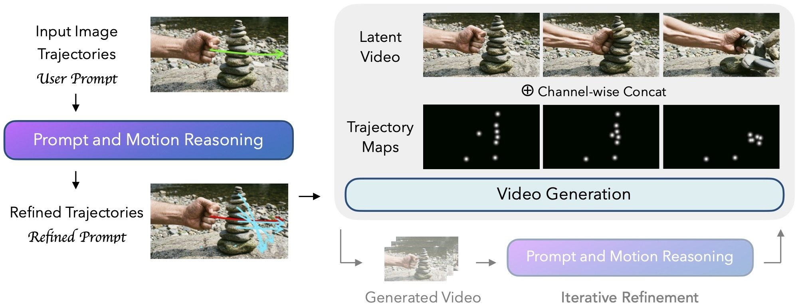

# MotiMotion: Motion-Controlled Video Generation with Visual Reasoning

[Lee Hsin-Ying](https://shinying.github.io/)<sup>1</sup>&emsp;[Hanwen Jiang](https://hwjiang1510.github.io/)<sup>2</sup>&emsp;[Yiqun Mei](https://yiqunmei.net/)<sup>2</sup>&emsp;[Jing Shi](https://jshi31.github.io/jingshi/)<sup>2</sup>&emsp;[Ming-Hsuan Yang](https://faculty.ucmerced.edu/mhyang)<sup>1</sup>&emsp;[Zhixin Shu](https://zhixinshu.github.io/)<sup>2</sup>

<sup>1</sup>University of California, Merced&emsp;&emsp;<sup>2</sup>Adobe Research

[](https://motimotion.github.io/)
[](https://arxiv.org/abs/2605.22818)
[](https://huggingface.co/datasets/shinying/motibench)



MotiMotion uses a training-free visual-language reasoner to refine user intent, infer missing motion, and improve controllability for complex interactions.

## Citation

```bibtex
@inproceedings{hsinying2026motimotion,
  title={MotiMotion: Motion-Controlled Video Generation with Visual Reasoning},
  author={Hsin-Ying, Lee and Jiang, Hanwen and Mei, Yiqun and Shi, Jing and Yang, Ming-Hsuan and Shu, Zhixin},
  booktitle={Forty-third International Conference on Machine Learning},
  year={2026},
}
```
